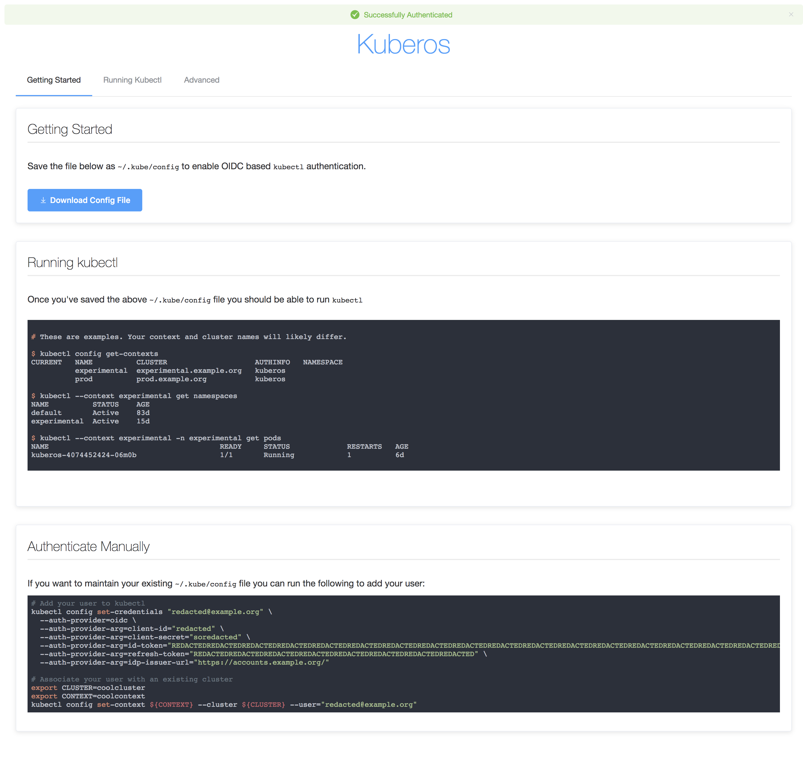

# kuberos

An OIDC authentication helper for Kubernetes' `kubectl`.



Forked from: https://github.com/negz/kuberos

## Purpose
Kubernetes supports several authentication methods, a popular one of which is OIDC.
The `kubectl` commandline tool can be configured to use OIDC authentication, including
automatically refreshing its token on invocation. In order to enable this
functionality `kubectl` must be configured with the following parameters:
* A client ID
* A client secret
* An issuer URL
* An ID token
* A refresh token

The latter two of these parameters must be aquired by performing an initial OIDC
authentication outside of `kubectl`. OIDC is an awkward authentication method for a
commandline tool as it is entirely browser based. Existing implementations (see
Alternatives) provide CLI tools to handle this initial authentication. These CLIs will
typically require the user connect to localhost in their Browser to perform the initial
authentication.

Kuberos is designed to instead run as a hosted service. It authenticates users against
an OIDC provider, returning a JSON payload of the parameters required by
`kubectl`. Kuberos provides a simple frontend that links to a `~/.kube/config` file
generated from a supplied template of clusters. It also details how to manually add a
user and context to a cluster, and how to use kubectl.

## Usage
Before using Kuberos you must
[enable OIDC at the Kubernetes API server](https://kubernetes.io/docs/admin/authentication/#openid-connect-tokens).
Refer to [this guide](https://auth0.com/docs/connections/enterprise/oidc)
for details on how to setup OIDC Provider from Auth0. 

Kuberos is [published](https://hub.docker.com/r/ministryofjustice/cloud-platform-kuberos) to the Docker Hub.

To build the docker image locally execute the script

```bash
./scripts/build.sh
```

To run kuberos locally, it must be configured with an OIDC issuer, client ID, and secret, as well as a
partial `kubeconfig` file. 
- Register your Application with Auth0 and fetch the clientID and ClientSecret
- Set the callback url to include `http://localhost:10003/ui` 
- Fetch the ClientID and clientsecret of your application in Auth0 and set the values in the script 
  `scripts/run.sh` and run the script

Kuberos supports the following arguments:
```bash
$ docker run ministryofjustice/cloud-platform-kuberos:latest /kuberos --help
usage: kuberos [<flags>] [<oidc-issuer-url>] [<client-id>] [<client-secret-file>] [<kubecfg-template>]

Provides OIDC authentication configuration for kubectl.

Flags:
      --help                   Show context-sensitive help (also try --help-long
                               and --help-man).
      --listen=":10003"        Address at which to expose HTTP webhook.
  -d, --debug                  Run with debug logging.
      --scopes=profile... ...  List of additional scopes to provide in token.
      --email-domain=EMAIL-DOMAIN
                               The eamil domain to restrict access to.
      --shutdown-grace-period=1m
                               Wait this long for sessions to end before
                               shutting down.
      --shutdown-endpoint=SHUTDOWN-ENDPOINT
                               Insecure HTTP endpoint path (e.g., /quitquitquit)
                               that responds to a GET to shut down kuberos.

Args:
  [<oidc-issuer-url>]     OpenID Connect issuer URL.
  [<client-id>]           OAuth2 client ID.
  [<client-secret-file>]  File containing OAuth2 client secret.
  [<kubecfg-template>]    A kubecfg file containing clusters to populate with a user and contexts.
```

The partial `kubeconfig` template should contain only cluster entries and
optionally a current (i.e. default) context, which must be the name of one of
the clusters. For example:

```yaml
apiVersion: v1
kind: Config
current-context: staging
clusters:
- name: production
  cluster:
    certificate-authority-data: REDACTED
    server: https://prod.example.org
- name: staging
  cluster:
    certificate-authority-data: REDACTED
    server: https://staging.example.org
```

Given the above template Kuberos will generate a `kubeconfig` file containing
the two supplied clusters, the authenticated OIDC user, and a context for each
cluster associating them with the OIDC user. These contexts inherit the name of
the clusters, thus a user could interact with the production cluster by running:
```bash
kubectl --context production cluster-info
```

If the `current-context` is set to the name of one of the clusters then the
`--context` argument may be omitted, and the cluster named by `current-context`
will be used.

## Deploying to Kubernetes
Kuberos can be run inside a cluster as long as it can still communicate with
your OIDC provider from inside the pod and your OIDC provider is set to
redirect to your Kuberos endpoint (NodePort, LoadBalancer, etc).

Every cluster of Cloud Platform is registered with Auth0 as part of cluster creation.

Deploying the kuberos to the cluster is done via helm  chart. Use [cloud platform helm charts - kuberos](https://github.com/ministryofjustice/cloud-platform-helm-charts/tree/main/kuberos) for deploying.

Update the `charts/values.yaml` for host, oidc details fetched from Auth0 and the cluster values. 

```bash
helm install -n kuberos kuberos . -f values.yaml
```
## Local development
### Prerequisites
* go1.16.3

* npm 8

* node: 16.14.0

### Installation

#### Clone the code
```git clone https://github.com/ministryofjustice/cloud-platform-kuberos.git```

## Structure
The frontend code, javascript and vue components, are inside the sub folder `src`.
main.js : The application entrypoint
kuberos.vue: The root component that creates custom elements, which can be reused in HTML
webpack.config.js: webpack build config file. This is used to start the app entrypoint and then build a dependency graph 
of the whole application, pulling those dependencies into one or more bundles that can be included in our application. 

The authentication with OIDC provider and building the kubecfg is written in go. This include
- `cmd/kuberos`: main package which build the `kuberos` binary
- `extractor`: an OIDC extractor performs OIDC validation, extracting and storing the information required for Kubernetes authentication along the way.
- `kuberos.go`: contains handler functions to interact with the frontend when doing login redirects and forms kubecfg file from the template adding the values returned from the URL parameters of the frontend

#### Install, running and testing frontend
The Frontend can be run with the Node Package manager. All the npm packages are defined in `package.json`

To install the packages do
```
$ npm install
```

To run the app in the development mode,
```
npm run dev
```
This will run the webpack-dev-server locally on port 8080 and you can visit the page http://localhost:8080/

For the production 
```
npm run build
```

#### Install, running and testing Authentication backend `go` code

To build the kuberos binary run

```bash
go build -o /kuberos ./cmd/kuberos
```


Testing
```bash
go test -v
```

## Alternatives
OIDC/LDAP/static helper specifically for `dex` (Helm charts for dex+helper included)
* https://github.com/mintel/dex-k8s-authenticator

OIDC helpers that run locally to setup `kubectl`:
* https://github.com/micahhausler/k8s-oidc-helper
* https://github.com/coreos/dex/tree/master/cmd/example-app

A Kubernetes JWT webhook helper with a similar UX to Kuberos
* https://github.com/negz/kubehook

## Contributors
[Nic Cope](https://github.com/negz) - Creator

[Rajat Sharma](https://github.com/Sharma-Rajat) - Frontend

[Maxime Guyot](https://github.com/Miouge1)

[Ripta Pasay](https://github.com/ripta)

[John Delivuk](https://github.com/john-delivuk)

[Aaron Roydhouse](https://github.com/whereisaaron)

[keattang](https://github.com/keattang)

[jimangel](https://github.com/jimangel)

[arnoldbechtoldt](https://github.com/arnoldbechtoldt)
